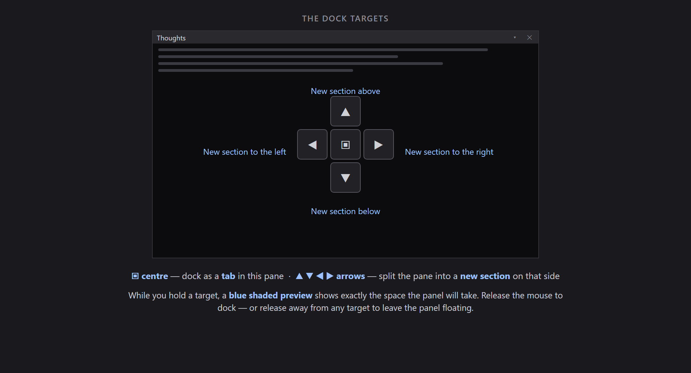
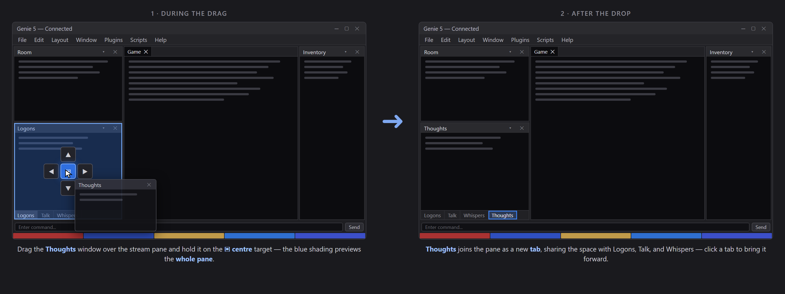
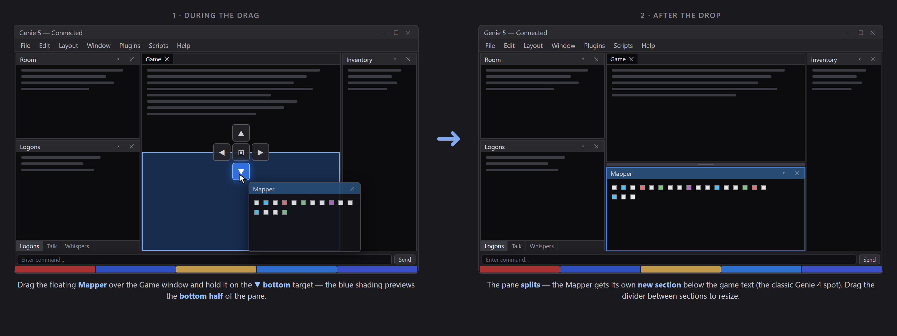

# Docking Windows

Almost everything in Genie 5 — the Room panel, the stream windows, Inventory, the Mapper, Experience, and the rest — lives in a **dock**: a tiled arrangement of panes you can rearrange by dragging. There are two ways a dragged window can land: **as a tab** (sharing a pane with other windows) or **as a new section** (splitting off its own space). This page walks through both, plus floating, resizing, and getting windows back.

> Panels are shown and hidden from the **Window** menu; your arrangement is remembered automatically, and can be kept as named presets — see [Layouts](The-Interface#layouts).

## Starting a drag

Press and hold a panel's **tab** (or a floating window's title bar) and move the mouse. As you drag, a cross of **dock targets** appears over whichever pane is under your pointer, and a **blue shaded preview** shows exactly where the window will land before you commit:

- The **▣ centre** target docks the window **as a tab** in that pane.
- The **▲ ▼ ◀ ▶ arrow** targets split the pane, giving the window a **new section** on that side.
- Release the mouse on a target to dock — or release away from any target to leave the window **floating** (see below).

The one exception is the main **Game** window: it anchors the layout and can't be floated out — everything else docks around it.

## Docking as a tab

Drop a window on the **▣ centre** target and it joins that pane's **tab group** — the windows share the same space, with a tab strip along the pane's bottom edge to switch between them. This is how the default layout keeps the stream windows (Logons, Talk, Whispers, Thoughts, Combat) stacked in one pane:

Tab docking is the space-saver: use it for windows you check on demand rather than watch constantly. One thing to know: a background tab quietly collects its text until you click it — if you'd rather never miss a stream, give it its own section instead, or turn on that stream's *"Also show this stream in the Main window"* toggle (Configuration → **Layout** tab).

## Docking as a new section

Drop a window on one of the four **arrow** targets and the pane under your pointer **splits**: your window gets its own section on that side, always visible in its own space. The blue preview shows exactly the half it will take:

The classic example: the Mapper starts out **floating**, and dragging it onto the Game window's **▼ bottom** target docks it below the game text — the spot Genie 4 users know. Any edge of any pane works the same way, so you can build up multi-column, multi-row arrangements one drop at a time.

To **resize** sections, drag the divider between them.

## Floating and re-docking

A window doesn't have to live in the dock at all:

- **Drag it out** — release the drag away from any dock target and the window floats in its own OS window (handy for a second monitor).
- **Right-click → Float** — every window's right-click menu has a **Float** entry; on a window that's already floating it reads **Re-dock** and sends it back into the layout.
- **Hide Title Bar** — a floating window's right-click menu also offers **Hide Title Bar** for a chromeless, screen-space-saving float; bring it back with **Show Title Bar**.

To re-dock by hand, drag the floating window back over the main window and use the same dock targets as always.

## Closing and getting windows back

The **✕** on a tab or title bar closes that window. To bring it back, open the **Window** menu and toggle it on again — it returns to the spot it occupied before it was closed, even if closing it collapsed the pane it lived in.

## Keeping your arrangement

Everything on this page is remembered automatically between sessions. Beyond that:

- **Layout → Save Layout As… / Load Layout / Manage Layouts…** — keep several named arrangements and switch between them.
- **Layout → Reset to Default Layout** — back to the out-of-the-box three-column arrangement.
- **Layout → Windowed Mode (MDI)** — prefer free-floating child windows over docked panes entirely, Genie 4-style.

## Related

- [The Interface](The-Interface) — a tour of every panel and the bottom strips.
- [The Mapper](Mapper) — the panel you're most likely to be dragging.
- [Configuration & Rules](Configuration) — per-window fonts and the "also show in Main" stream toggles.
